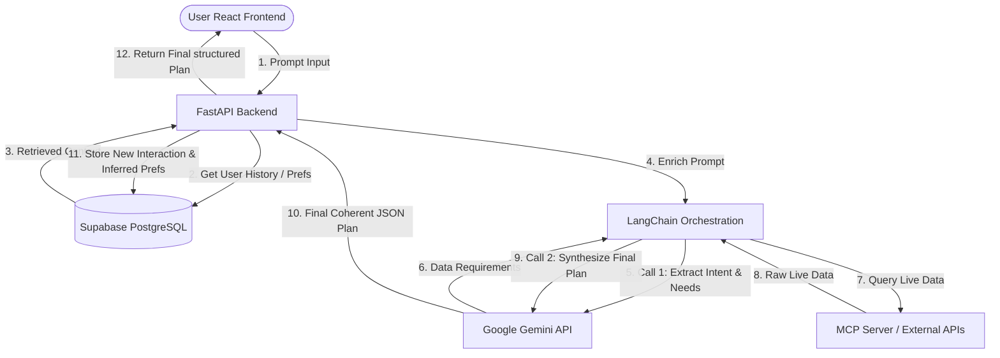

# Aether Context Engine (ACE) — Solution Plan

The Aether Context Engine (ACE) is a stateful AI orchestration layer designed to solve the stateless limitation of modern AI assistants. By maintaining persistent user context, learning preferences over time, fetching live data via MCP (Model Context Protocol) servers/external APIs, and executing multi-step workflows, ACE provides a coherent personalized travel planning experience.

---

## 🏗️ System Architecture & Workflow

ACE orchestrates interactions through the following pipeline:

---

## 📊 The 6 Runtime Evaluation Metrics

To ensure system accuracy, reliability, and personalization efficiency at runtime, we will track the following 6 core metrics:

| Metric | What it measures | How it is measured & logged |
| :--- | :--- | :--- |
| **1. Workflow Completion Rate** | Pipeline execution stability without fallback triggers. | `(Successful executions / Total runs) * 100` logged in Supabase. |
| **2. Preference Retention Accuracy** | Prompt injection/context alignment verification across sessions. | Evaluated via 10 automated test scenarios checking if previous preferences are correctly applied. |
| **3. Budget Calculation Variance** | Reliability of LLM-generated budget calculations vs real prices. | `(Estimated Budget - Actual Fetched Price) / Actual Price` logged per session. |
| **4. Context Relevance Score** | Subjective / objective value of injected historical context. | Simple user rating (1-5 stars) at the end of each travel session. |
| **5. API Response Latency** | End-to-end execution time from UI submit to response. | Timestamp logging at API gateway ingress and egress (in milliseconds). |
| **6. Hallucination Rate** | Percentage of itinerary recommendations unsupported by live data. | Manual audit of 20 random outputs, checking for unsubstantiated claims. |

---

## 📅 Phase-by-Phase Implementation Plan

### Phase 1: Foundation (Days 1–2)
* **Goal:** Set up a simple, stateless end-to-end pipeline: Frontend ➡️ Backend ➡️ Gemini API ➡️ Frontend.
* **Tasks:**
  * Initialize the Python FastAPI backend project structure.
  * Set up dependencies: `fastapi`, `uvicorn`, `langchain`, `google-generativeai`, `python-dotenv`.
  * Configure environment variables (`.env`) for Gemini API authentication.
  * Build a POST endpoint `/chat` that accepts user input, queries Gemini (using a basic travel system prompt), and returns the response.
  * Initialize a React frontend containing a clean, responsive chat window.
  * Integrate Axios on the frontend to call the backend `/chat` endpoint.
* **Verification:** Send *"Plan a 3-day trip to Goa for 2 people with a ₹20,000 budget"* and verify that Gemini returns a valid stateless plan.

### Phase 2: Context & Memory Layer (Days 3–4)
* **Goal:** Implement persistent database storage for user preferences and history.
* **Tasks:**
  * Configure a Supabase project and create three key tables:
    * `users`: `user_id`, `name`, `created_at`
    * `user_context`: `user_id`, `preference_key`, `preference_value`, `updated_at` (stores extracted preferences like budget level, type of destination, likes/dislikes)
    * `interaction_history`: `user_id`, `session_id`, `input`, `output`, `timestamp`
  * Add the Supabase SDK (`supabase-py`) to the backend.
  * Build the context-retrieval service to fetch user preferences before sending prompts to Gemini.
  * Build the preference extractor (a background Gemini call or prompt step) that updates Supabase tables when a user shares new preferences.
  * Upgrade the prompt template in LangChain to inject the retrieved user preferences.
* **Verification:** 
  1. *Session 1:* Tell ACE: *"I prefer budget accommodations and quiet, nature-focused destinations."*
  2. *Session 2 (New Session):* Ask: *"Plan a weekend trip."* ACE should automatically suggest a budget-friendly nature spot without prompting again.

### Phase 3: Live Data Integration (Days 5–6)
* **Goal:** Integrate live external APIs/MCP servers to feed real-world data (weather, pricing, locations) into the engine.
* **Tasks:**
  * Select and integrate live data services:
    * **Google Places API** (locations and details)
    * **Open-Meteo API** (weather forecasts)
    * **ExchangeRate API** (currency conversions)
  * Set up LangChain's Tool Calling layer.
  * Configure a two-pass generation pipeline:
    * *Pass 1:* Gemini reads the user prompt, decides which tools/APIs to call, and retrieves parameters.
    * *Pass 2:* Backend queries the APIs, injects the real-time JSON payload back into the model context, and prompts Gemini to synthesize the final plan.
  * Enforce strict structured output JSON format from the backend (`itinerary`, `budget_breakdown`, `accommodation_suggestions`, `travel_tips`).
  * Design a beautiful, card-based React UI to render the structured JSON data.
* **Verification:** Ask for *"Manali in August."* Verify that the output includes correct seasonal weather details and real place names.

### Phase 4: Performance & Evaluation Dashboard (Day 7)
* **Goal:** Log system performance metrics and present them on a monitoring UI.
* **Tasks:**
  * Instrument the backend endpoints to track API response latency, run success rates, and budget variances.
  * Write these metrics directly to Supabase logs on every chat run.
  * Create a `/metrics` API endpoint that aggregates stats (completion rate, latency averages, total sessions).
  * Build a simple admin dashboard view in the React frontend to view system health and performance statistics.
  * Perform manual regression runs (10+ preference tests) and update the hallucination audit log.
* **Verification:** Open `/metrics` or the frontend admin panel and verify all 6 metrics render correctly based on recent chat history.

### Phase 5: Deployment & Release (Day 8)
* **Goal:** Host the application live on the cloud.
* **Tasks:**
  * Configure a public Git repository.
  * Deploy the FastAPI backend on **Railway** (or Render) using a `Procfile` and set all env keys.
  * Deploy the React frontend on **Vercel** pointing to the Railway API URL.
  * Perform end-to-end verification of the deployed live link.
* **Verification:** Access the public Vercel URL, perform a multi-session personalization test, and check Supabase for recorded logs.
